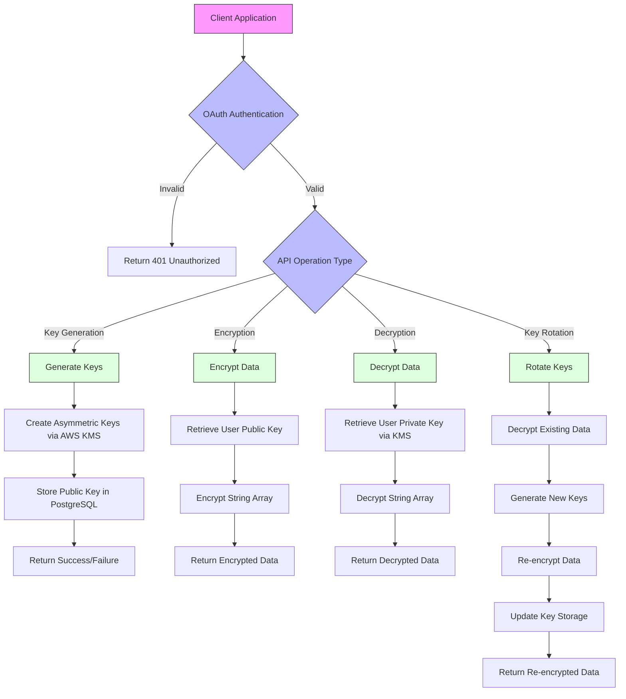
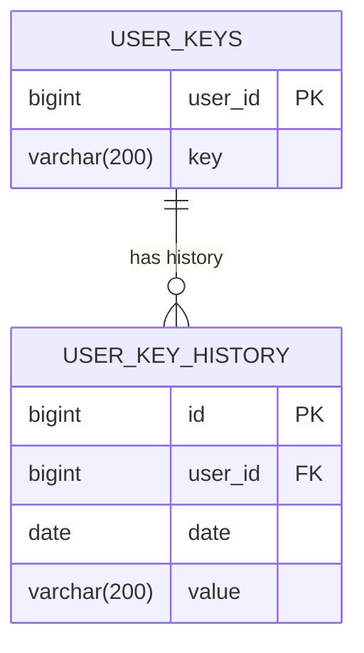
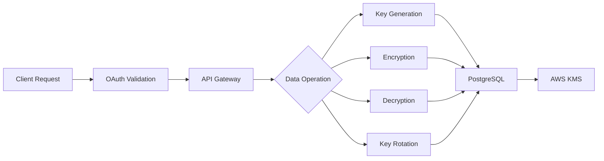
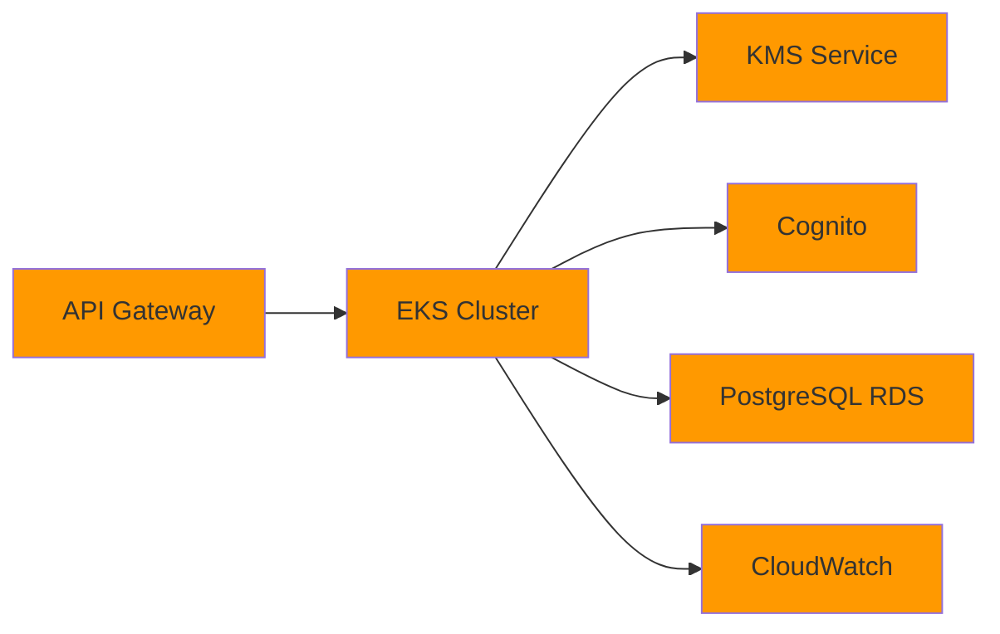

# Product Requirements Document (PRD)

# 1. INTRODUCTION

## 1.1 Purpose
This Software Requirements Specification (SRS) document provides a comprehensive description of the EstateKit Personal Information API implementation. It is intended for:
- Development team members implementing the encryption service
- System architects and designers
- Quality assurance testers
- Project managers overseeing the implementation
- Technical stakeholders involved in system integration

## 1.2 Scope
The EstateKit Personal Information API is a secure encryption service that manages user-specific encryption keys and handles encryption/decryption operations for sensitive personal data. The system encompasses:

- Generation and management of user-specific asymmetric encryption keys using AWS KMS
- Secure encryption and decryption of user data strings
- Automated key rotation mechanism with data re-encryption
- Integration with AWS Cognito for OAuth authentication
- Dedicated PostgreSQL database for key storage

Key benefits:
- Enhanced security through user-specific encryption keys
- Separation of encryption keys from primary data storage
- Regular key rotation to maintain security standards
- Compliance with financial regulatory requirements
- Scalable cloud-native architecture

The system specifically excludes:
- User interface components
- Primary data storage functionality
- User authentication and authorization management (handled by AWS Cognito)
- Direct interaction with end users

# 2. PRODUCT DESCRIPTION

## 2.1 Product Perspective
The EstateKit Personal Information API operates as a dedicated encryption service within the larger EstateKit ecosystem. It functions as an independent microservice that:
- Interfaces with AWS KMS for cryptographic operations
- Maintains its own PostgreSQL database for key storage
- Integrates with AWS Cognito for authentication
- Provides encryption services to other EstateKit components while maintaining strict separation of concerns

## 2.2 Product Functions
The system provides four core functions:
1. Key Generation
   - Creates user-specific asymmetric encryption keys via AWS KMS
   - Stores public keys in the user_keys table
   - Associates keys with unique user IDs

2. Data Encryption
   - Accepts arrays of plaintext strings
   - Encrypts data using user-specific public keys
   - Returns arrays of encrypted strings

3. Data Decryption
   - Accepts arrays of encrypted strings
   - Decrypts data using user-specific private keys
   - Returns arrays of decrypted strings

4. Key Rotation
   - Decrypts existing data
   - Generates new encryption keys
   - Re-encrypts data with new keys
   - Updates key storage
   - Maintains key history

## 2.3 User Characteristics
The API is designed for programmatic access by:
- Backend developers integrating encryption services
- System administrators managing key rotation
- Security engineers monitoring cryptographic operations
- DevOps engineers maintaining deployment infrastructure

All users must possess:
- Understanding of REST API principles
- Knowledge of OAuth authentication flows
- Familiarity with encryption concepts
- Experience with AWS services

## 2.4 Constraints
Technical Constraints:
- Must use .NET Core 9 and C# for implementation
- Required use of Entity Framework 10 as ORM
- PostgreSQL database compatibility
- AWS platform dependencies

Security Constraints:
- OAuth authentication mandatory for all API calls
- Compliance with financial regulatory requirements
- Strict key isolation requirements
- Regular key rotation requirements

Performance Constraints:
- 3-second maximum load time
- 99.9% uptime requirement

## 2.5 Assumptions and Dependencies
Assumptions:
- AWS services will remain available and compatible
- PostgreSQL database will handle expected data volumes
- User IDs will remain consistent across the EstateKit ecosystem
- Network latency between services will be minimal

Dependencies:
- AWS Key Management Service (KMS)
- AWS Cognito OAuth service
- AWS EKS for container orchestration
- PostgreSQL RDBMS (estatekit DB)
- Entity Framework 10
- .NET Core 9 runtime environment

# 3. PROCESS FLOWCHART

# 4. FUNCTIONAL REQUIREMENTS

## 4.1 Key Generation Feature

### ID: F001
### Description
Generates and stores user-specific asymmetric encryption keys using AWS KMS
### Priority
Critical (P0)

| Requirement ID | Requirement Description | Acceptance Criteria |
|----------------|------------------------|-------------------|
| F001.1 | System must generate asymmetric key pairs using AWS KMS | - Successful key pair generation via AWS KMS - Keys meet cryptographic standards |
| F001.2 | System must store public key in user_keys table | - Public key stored with correct user_id - Key stored in correct format (varchar 200) |
| F001.3 | System must validate user ID before key generation | - Verification of valid user ID through AWS Cognito - Error handling for invalid IDs |
| F001.4 | System must prevent duplicate key generation | - Check for existing keys before generation - Error handling for duplicate requests |

## 4.2 Data Encryption Feature

### ID: F002
### Description
Encrypts arrays of plaintext strings using user-specific public keys
### Priority
Critical (P0)

| Requirement ID | Requirement Description | Acceptance Criteria |
|----------------|------------------------|-------------------|
| F002.1 | System must retrieve correct public key for user | - Successful key lookup by user_id - Error handling for missing keys |
| F002.2 | System must encrypt multiple strings in parallel | - Successful batch encryption - Maintain string order in array |
| F002.3 | System must validate input string format | - Input validation for string length/format - Error handling for invalid inputs |
| F002.4 | System must return encrypted data in consistent format | - Consistent encryption output format - Verification of encryption success |

## 4.3 Data Decryption Feature

### ID: F003
### Description
Decrypts arrays of encrypted strings using user-specific private keys via AWS KMS
### Priority
Critical (P0)

| Requirement ID | Requirement Description | Acceptance Criteria |
|----------------|------------------------|-------------------|
| F003.1 | System must securely access private key via AWS KMS | - Successful KMS private key access - Secure key handling |
| F003.2 | System must decrypt multiple strings in parallel | - Successful batch decryption - Maintain string order in array |
| F003.3 | System must validate encrypted input format | - Validation of encryption format - Error handling for invalid formats |
| F003.4 | System must handle decryption failures gracefully | - Proper error handling - Meaningful error messages |

## 4.4 Key Rotation Feature

### ID: F004
### Description
Performs automated key rotation with data re-encryption
### Priority
High (P1)

| Requirement ID | Requirement Description | Acceptance Criteria |
|----------------|------------------------|-------------------|
| F004.1 | System must decrypt existing data before rotation | - Successful decryption of all data - Verification of decryption integrity |
| F004.2 | System must generate new key pair | - Successful new key generation - Validation of new key pair |
| F004.3 | System must re-encrypt all data with new key | - Successful re-encryption - Data integrity verification |
| F004.4 | System must store key history | - Record in user_key_history table - Correct timestamp and key value storage |
| F004.5 | System must handle rotation failures | - Rollback mechanism - Data consistency maintenance |

# 5. NON-FUNCTIONAL REQUIREMENTS

## 5.1 Performance Requirements

| Requirement | Description | Target Metric |
|-------------|-------------|---------------|
| Response Time | Maximum API response time for single operations | < 3 seconds |
| Batch Processing | Maximum time for batch encryption/decryption | < 5 seconds per 100 items |
| Throughput | Minimum number of concurrent requests | 1000 requests/second |
| Resource Usage | Maximum CPU utilization | < 80% |
| Memory Usage | Maximum memory consumption | < 2GB per container |
| Database Performance | Maximum query execution time | < 500ms |

## 5.2 Safety Requirements

| Requirement | Description | Implementation |
|-------------|-------------|----------------|
| Data Backup | Regular backup of encryption keys | Daily automated backups |
| Failure Recovery | System recovery mechanism | Automated failover to standby |
| Data Consistency | Maintain data integrity during failures | Transaction rollback mechanisms |
| Error Handling | Comprehensive error management | Structured error logging and monitoring |
| Disaster Recovery | Business continuity plan | RPO: 1 hour, RTO: 4 hours |

## 5.3 Security Requirements

| Requirement | Description | Implementation |
|-------------|-------------|----------------|
| Authentication | OAuth 2.0 implementation | AWS Cognito integration |
| Authorization | Role-based access control | JWT token validation |
| Data Encryption | Asymmetric encryption standard | AWS KMS with 2048-bit RSA |
| Key Storage | Secure key management | Isolated PostgreSQL database |
| Audit Logging | Security event tracking | AWS CloudWatch integration |
| Network Security | Secure communication | TLS 1.3 encryption |

## 5.4 Quality Requirements

### 5.4.1 Availability
- System uptime: 99.9%
- Maximum planned downtime: 8 hours/year
- Automated health checks every 5 minutes

### 5.4.2 Maintainability
- Code coverage minimum: 85%
- Documentation requirements: OpenAPI/Swagger
- Automated deployment pipeline
- Infrastructure as Code implementation

### 5.4.3 Usability
- API versioning support
- Consistent error response format
- Comprehensive API documentation
- Clear status codes and messages

### 5.4.4 Scalability
- Horizontal scaling capability
- Auto-scaling based on CPU utilization
- Database connection pooling
- Caching implementation for frequent requests

### 5.4.5 Reliability
- Fault tolerance through redundancy
- Automated failover mechanisms
- Data consistency checks
- Regular performance monitoring

## 5.5 Compliance Requirements

| Requirement | Description | Standard |
|-------------|-------------|----------|
| Data Protection | Personal data handling | GDPR compliance |
| Financial Services | Security standards | PCI DSS Level 1 |
| Encryption Standards | Cryptographic requirements | FIPS 140-2 |
| API Standards | REST API implementation | OpenAPI 3.0 |
| Cloud Security | AWS service usage | AWS Well-Architected Framework |
| Audit Requirements | Security logging | SOC 2 Type II compliance |

# 6. DATA REQUIREMENTS

## 6.1 Data Models

### 6.1.1 Entity Relationship Diagram

### 6.1.2 Data Dictionary

| Table | Column | Type | Constraints | Description |
|-------|--------|------|-------------|-------------|
| user_keys | user_id | bigint | PK, NOT NULL | Unique identifier for user |
| user_keys | key | varchar(200) | NOT NULL | Current public encryption key |
| user_key_history | id | bigint | PK, NOT NULL | Auto-incrementing history record ID |
| user_key_history | user_id | bigint | FK, NOT NULL | Reference to user_keys.user_id |
| user_key_history | date | date | NOT NULL | Date of key rotation |
| user_key_history | value | varchar(200) | NULL | Historical public key value |

## 6.2 Data Storage

### 6.2.1 Storage Requirements
- Primary storage: PostgreSQL RDBMS (estatekit DB)
- Storage scaling: Automatic with AWS RDS
- Data volume estimation: 1KB per key × number of users
- Growth rate: Linear with user base expansion

### 6.2.2 Data Retention
- Active keys: Retained indefinitely while user account is active
- Historical keys: Retained for 7 years for compliance
- Soft deletion implementation for user key deactivation
- Automated archival process for expired historical records

### 6.2.3 Backup and Recovery
- Full daily backups to AWS S3
- Point-in-time recovery capability up to 35 days
- Cross-region backup replication
- Recovery Time Objective (RTO): 4 hours
- Recovery Point Objective (RPO): 1 hour

## 6.3 Data Processing

### 6.3.1 Data Flow

### 6.3.2 Data Security
- Encryption at rest using AWS RDS encryption
- TLS 1.3 for data in transit
- Column-level encryption for sensitive fields
- AWS KMS integration for key management
- Database access restricted to API service principal
- Regular security audits and penetration testing

### 6.3.3 Data Integrity
- Foreign key constraints enforcement
- Transaction isolation level: SERIALIZABLE
- Checksums for key verification
- Version control for key rotation
- Automated data validation checks
- Conflict resolution mechanisms for concurrent updates

# 7. EXTERNAL INTERFACES

## 7.1 Software Interfaces

### 7.1.1 AWS Services Integration

| Service | Interface Type | Purpose |
|---------|---------------|----------|
| AWS KMS | AWS SDK | Asymmetric key generation and management |
| AWS Cognito | OAuth 2.0 | User authentication and authorization |
| AWS EKS | Kubernetes API | Container orchestration |
| AWS CloudWatch | REST API | Logging and monitoring |

### 7.1.2 Database Interface

| Component | Specification |
|-----------|--------------|
| Database Type | PostgreSQL RDBMS |
| ORM | Entity Framework 10 |
| Connection Pool Size | 100 connections |
| Timeout Settings | 30 seconds |
| SSL Mode | Required |

### 7.1.3 API Specifications

| Specification | Value |
|---------------|-------|
| API Style | REST |
| Data Format | JSON |
| API Version | v1 |
| Documentation | OpenAPI 3.0 |
| Content Type | application/json |
| Character Encoding | UTF-8 |

## 7.2 Communication Interfaces

### 7.2.1 Network Protocols

| Protocol | Usage | Specification |
|----------|--------|---------------|
| HTTPS | API Communication | TLS 1.3 |
| TCP/IP | Database Connection | TLS-encrypted |
| gRPC | Internal Services | HTTP/2 |

### 7.2.2 API Endpoints

| Endpoint | Method | Purpose |
|----------|--------|----------|
| /api/v1/keys | POST | Generate new encryption key |
| /api/v1/encrypt | POST | Encrypt data array |
| /api/v1/decrypt | POST | Decrypt data array |
| /api/v1/rotate | POST | Rotate encryption key |

### 7.2.3 Security Protocols

| Protocol | Implementation |
|----------|----------------|
| OAuth 2.0 | AWS Cognito |
| JWT | Token-based authentication |
| mTLS | Service-to-service communication |
| API Keys | External service authentication |

## 7.3 AWS Infrastructure Interfaces

### 7.3.1 Service Integration Requirements

| AWS Service | Integration Method | Configuration |
|-------------|-------------------|---------------|
| API Gateway | REST API | Custom domain, WAF integration |
| EKS | AWS EKS API | Managed node groups, autoscaling |
| RDS | Entity Framework | SSL connection, IAM authentication |
| CloudWatch | AWS SDK | Custom metrics, log groups |
| KMS | AWS SDK | Asymmetric key configuration |

# 8. APPENDICES

## 8.1 GLOSSARY

| Term | Definition |
|------|------------|
| Asymmetric Key | A cryptographic key pair consisting of a public key for encryption and private key for decryption |
| Key Rotation | The process of replacing an encryption key with a new one and re-encrypting data |
| Public Key | The encryption key that can be freely shared and used to encrypt data |
| Private Key | The secret decryption key that must be securely stored and used to decrypt data |
| OAuth Token | A security token used for authentication and authorization of API requests |

## 8.2 ACRONYMS

| Acronym | Definition |
|---------|------------|
| API | Application Programming Interface |
| AWS | Amazon Web Services |
| EKS | Elastic Kubernetes Service |
| GDPR | General Data Protection Regulation |
| JWT | JSON Web Token |
| KMS | Key Management Service |
| ORM | Object-Relational Mapping |
| PaaS | Platform as a Service |
| PCI DSS | Payment Card Industry Data Security Standard |
| RDBMS | Relational Database Management System |
| REST | Representational State Transfer |
| RPO | Recovery Point Objective |
| RTO | Recovery Time Objective |
| SOC | Service Organization Control |
| TLS | Transport Layer Security |

## 8.3 ADDITIONAL REFERENCES

| Reference | Description | URL |
|-----------|-------------|-----|
| AWS KMS Documentation | Technical documentation for AWS Key Management Service | https://docs.aws.amazon.com/kms |
| Entity Framework Documentation | Official documentation for EF Core 10 | https://learn.microsoft.com/ef/core |
| OAuth 2.0 Specification | Authentication protocol specification | https://oauth.net/2/ |
| PostgreSQL Documentation | Database technical documentation | https://www.postgresql.org/docs |
| AWS Well-Architected Framework | Best practices for AWS architecture | https://aws.amazon.com/architecture/well-architected |