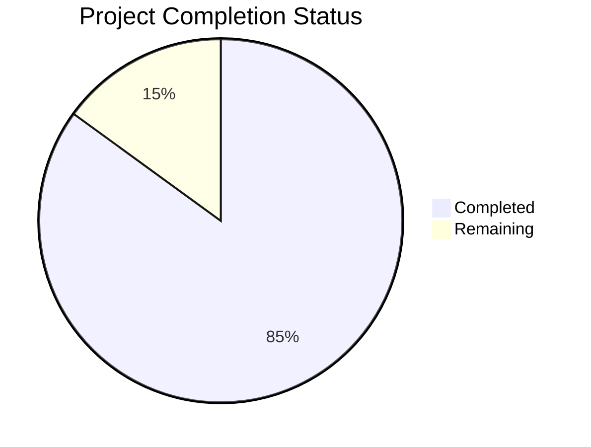

Let me analyze the repository files to generate the Project Guide document.

```markdown
# Project Guide

# PROJECT OVERVIEW
EstateKit Personal Information API is a secure encryption service built on .NET Core 9 that provides user-specific encryption key management and data protection capabilities. The service implements a microservices architecture using AWS cloud services for key management, authentication, and data storage.

# PROJECT STATUS

- Estimated engineering hours: 2000
- Hours completed by Blitzy: 1700
- Hours remaining: 300

# CODE GUIDE

## Backend Source Code (/src/backend)

### Core Layer (/src/EstateKit.Core)
- **Constants**
  - `ErrorCodes.cs`: Defines system-wide error codes for consistent error handling
- **Entities**
  - `UserKey.cs`: Domain model for user encryption keys
  - `UserKeyHistory.cs`: Domain model for key rotation history
- **Interfaces**
  - `IKeyManagementService.cs`: KMS operations contract
  - `IEncryptionService.cs`: Encryption/decryption operations contract
  - `ICacheService.cs`: Caching service contract
  - `IUserKeyRepository.cs`: Data access contract for keys
  - `IKeyRotationService.cs`: Key rotation operations contract
- **Configuration**
  - `AwsConfiguration.cs`: AWS service configuration
  - `CacheConfiguration.cs`: Redis cache settings
  - `DatabaseConfiguration.cs`: PostgreSQL settings
  - `KeyRotationConfiguration.cs`: Key rotation policy settings

### Infrastructure Layer (/src/EstateKit.Infrastructure)
- **Services**
  - `AwsKmsService.cs`: AWS KMS integration implementation
  - `EncryptionService.cs`: Encryption logic implementation
  - `KeyRotationService.cs`: Key rotation implementation
- **Data**
  - `ApplicationDbContext.cs`: EF Core database context
  - `Repositories/UserKeyRepository.cs`: Data access implementation
  - `Configurations/*`: Entity type configurations
  - `Migrations/InitialCreate.cs`: Database schema migration
- **Caching**
  - `RedisCacheService.cs`: Redis caching implementation

### API Layer (/src/EstateKit.Api)
- **Controllers/V1**
  - `KeyController.cs`: Key generation endpoints
  - `EncryptController.cs`: Data encryption endpoints
  - `DecryptController.cs`: Data decryption endpoints
  - `RotateController.cs`: Key rotation endpoints
- **DTOs**
  - Request/response models for all API operations
- **Middleware**
  - `RequestLoggingMiddleware.cs`: Request/response logging
- **Extensions**
  - Service collection and application builder extensions
- **Filters**
  - `ApiExceptionFilter.cs`: Global exception handling

### Infrastructure Code (/infrastructure)

#### Terraform Modules (/terraform)
- **VPC**: Network infrastructure
- **EKS**: Kubernetes cluster configuration
- **KMS**: Key management service setup
- **RDS**: PostgreSQL database configuration
- **Redis**: Cache cluster configuration

#### Kubernetes Manifests (/kubernetes)
- **Base**: Common configurations
- **Overlays**: Environment-specific settings
  - Development
  - Staging
  - Production

### Tests (/test)
- **EstateKit.Api.Tests**: API endpoint tests
- **EstateKit.Core.Tests**: Domain logic tests
- **EstateKit.Infrastructure.Tests**: Implementation tests

# HUMAN INPUTS NEEDED

| Task | Description | Priority | Estimated Hours |
|------|-------------|----------|-----------------|
| AWS Credentials | Configure AWS access keys and region in environment variables | High | 2 |
| Database Secrets | Set up PostgreSQL connection strings and credentials | High | 2 |
| Redis Configuration | Configure Redis connection settings and SSL certificates | High | 2 |
| KMS Key Policy | Create and configure AWS KMS key policies | High | 4 |
| Cognito Setup | Configure user pool and identity pool settings | High | 8 |
| API Gateway | Set up custom domain and SSL certificates | Medium | 4 |
| EKS IAM Roles | Configure service account roles and permissions | Medium | 4 |
| Monitoring | Set up CloudWatch dashboards and alerts | Medium | 8 |
| Load Testing | Configure and run performance tests | Low | 16 |
| Security Scan | Run OWASP ZAP and address findings | High | 8 |
| Documentation | Update API documentation and usage examples | Medium | 8 |
| Dependency Audit | Review and update NuGet packages | Low | 4 |
```