# Technical Specifications

# 1. INTRODUCTION

## 1.1 EXECUTIVE SUMMARY

The EstateKit Personal Information API is a secure encryption service designed to protect sensitive personal data through user-specific encryption keys. This system addresses the critical need for robust data protection in financial services by implementing a separate encryption key management service that ensures encrypted data in the primary EstateKit database cannot be decrypted without proper authorization. The service will provide REST API endpoints for key generation, data encryption/decryption, and automated key rotation while maintaining strict compliance with financial regulatory requirements.

The system serves backend developers, system administrators, and security engineers who require programmatic access to encryption services while ensuring complete separation of encryption keys from the primary data store. By implementing regular key rotation and leveraging AWS Key Management Service (KMS), the solution delivers enterprise-grade security with high availability and scalability.

## 1.2 SYSTEM OVERVIEW

### Project Context

| Aspect | Description |
|--------|-------------|
| Business Context | Part of EstateKit's secure personal information management ecosystem |
| Current Limitations | Need for isolated encryption key management and automated key rotation |
| Enterprise Integration | Interfaces with AWS Cognito for authentication and primary EstateKit database |

### High-Level Description

| Component | Implementation |
|-----------|----------------|
| Architecture | Microservice-based REST API using .NET Core 9 |
| Key Storage | Dedicated PostgreSQL database for encryption keys |
| Security | AWS KMS for asymmetric key generation and management |
| Deployment | Container-based deployment on AWS EKS |

### Success Criteria

| Criteria | Target Metric |
|----------|---------------|
| Performance | API response time < 3 seconds |
| Availability | 99.9% uptime |
| Security | Successful security audit and financial compliance certification |
| Scalability | Support for 1000+ concurrent requests |

## 1.3 SCOPE

### In-Scope

#### Core Features and Functionalities

| Feature | Description |
|---------|-------------|
| Key Generation | User-specific asymmetric key creation via AWS KMS |
| Data Encryption | Batch encryption of string arrays using public keys |
| Data Decryption | Secure decryption using private keys via AWS KMS |
| Key Rotation | Automated key rotation with data re-encryption |

#### Implementation Boundaries

| Boundary | Coverage |
|----------|----------|
| System Access | REST API endpoints only |
| Authentication | OAuth 2.0 via AWS Cognito |
| Data Types | String array encryption/decryption |
| Infrastructure | AWS cloud services and PostgreSQL |

### Out-of-Scope

- User interface components and frontend implementations
- User authentication and authorization management (handled by AWS Cognito)
- Primary data storage and management
- Direct end-user interactions
- Non-string data type encryption
- Offline operation modes
- Custom encryption algorithm implementation
- Manual key management interfaces

# 2. SYSTEM ARCHITECTURE

## 2.1 High-Level Architecture

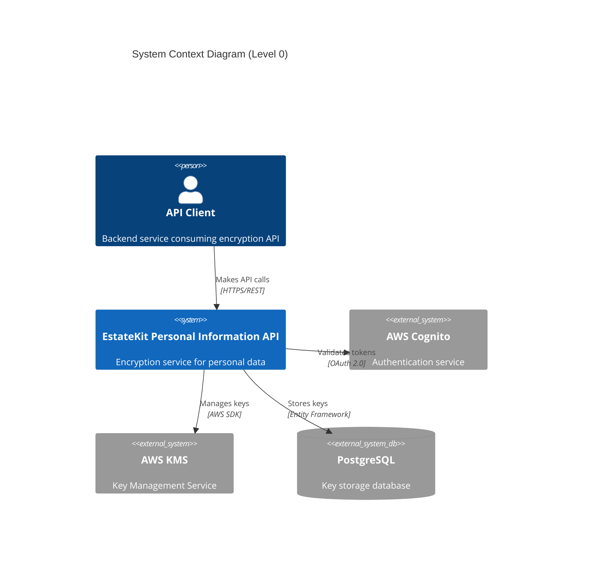
```mermaid
C4Context
    title System Context Diagram (Level 0)
    
    Person(client, "API Client", "Backend service consuming encryption API")
    System(encryptionApi, "EstateKit Personal Information API", "Encryption service for personal data")
    System_Ext(cognitoAuth, "AWS Cognito", "Authentication service")
    System_Ext(kms, "AWS KMS", "Key Management Service")
    SystemDb_Ext(postgres, "PostgreSQL", "Key storage database")
    
    Rel(client, encryptionApi, "Makes API calls", "HTTPS/REST")
    Rel(encryptionApi, cognitoAuth, "Validates tokens", "OAuth 2.0")
    Rel(encryptionApi, kms, "Manages keys", "AWS SDK")
    Rel(encryptionApi, postgres, "Stores keys", "Entity Framework")
```

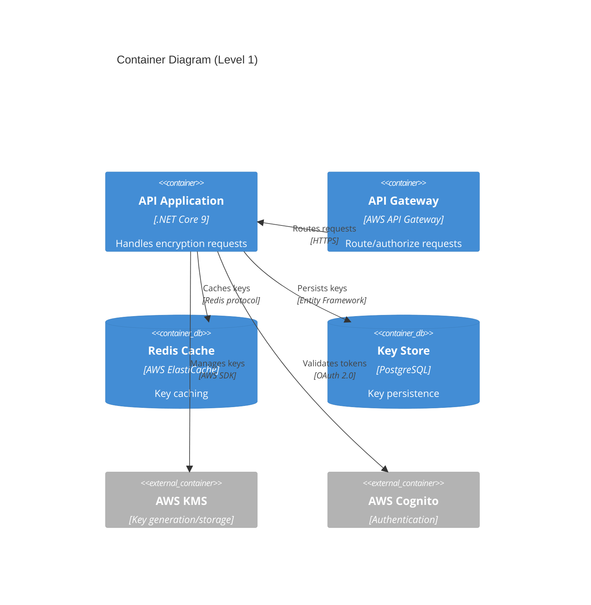
```mermaid
C4Container
    title Container Diagram (Level 1)
    
    Container(api, "API Application", ".NET Core 9", "Handles encryption requests")
    Container(gateway, "API Gateway", "AWS API Gateway", "Route/authorize requests")
    ContainerDb(cache, "Redis Cache", "AWS ElastiCache", "Key caching")
    ContainerDb(db, "Key Store", "PostgreSQL", "Key persistence")
    Container_Ext(kms, "AWS KMS", "Key generation/storage")
    Container_Ext(cognito, "AWS Cognito", "Authentication")
    
    Rel(gateway, api, "Routes requests", "HTTPS")
    Rel(api, cache, "Caches keys", "Redis protocol")
    Rel(api, db, "Persists keys", "Entity Framework")
    Rel(api, kms, "Manages keys", "AWS SDK")
    Rel(api, cognito, "Validates tokens", "OAuth 2.0")
```

## 2.2 Component Details

### 2.2.1 Core Components

| Component | Purpose | Technology | Scaling Strategy |
|-----------|---------|------------|------------------|
| API Service | Handle encryption requests | .NET Core 9 | Horizontal pod scaling |
| Key Store | Persist encryption keys | PostgreSQL | RDS read replicas |
| Cache Layer | Improve key retrieval | Redis | ElastiCache clustering |
| API Gateway | Request routing/auth | AWS API Gateway | Auto-scaling |
| Key Management | Cryptographic operations | AWS KMS | Regional failover |

### 2.2.2 Component Interactions

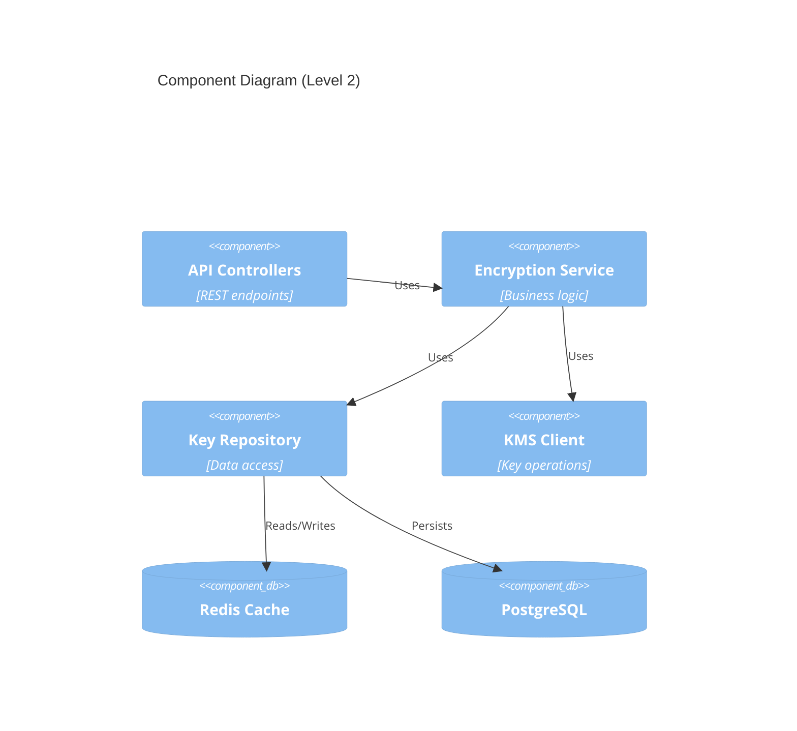
```mermaid
C4Component
    title Component Diagram (Level 2)
    
    Component(controller, "API Controllers", "REST endpoints")
    Component(service, "Encryption Service", "Business logic")
    Component(repo, "Key Repository", "Data access")
    Component(kmsClient, "KMS Client", "Key operations")
    ComponentDb(cache, "Redis Cache")
    ComponentDb(db, "PostgreSQL")
    
    Rel(controller, service, "Uses")
    Rel(service, repo, "Uses")
    Rel(service, kmsClient, "Uses")
    Rel(repo, cache, "Reads/Writes")
    Rel(repo, db, "Persists")
```

## 2.3 Technical Decisions

### 2.3.1 Architecture Patterns

| Pattern | Implementation | Justification |
|---------|----------------|---------------|
| Microservices | Single-responsibility API | Isolation of encryption concerns |
| CQRS | Separate read/write paths | Optimize key operations |
| Circuit Breaker | Polly framework | Resilient external service calls |
| Repository | Entity Framework | Abstract data access |
| Caching | Redis | Reduce database load |

### 2.3.2 Data Flow

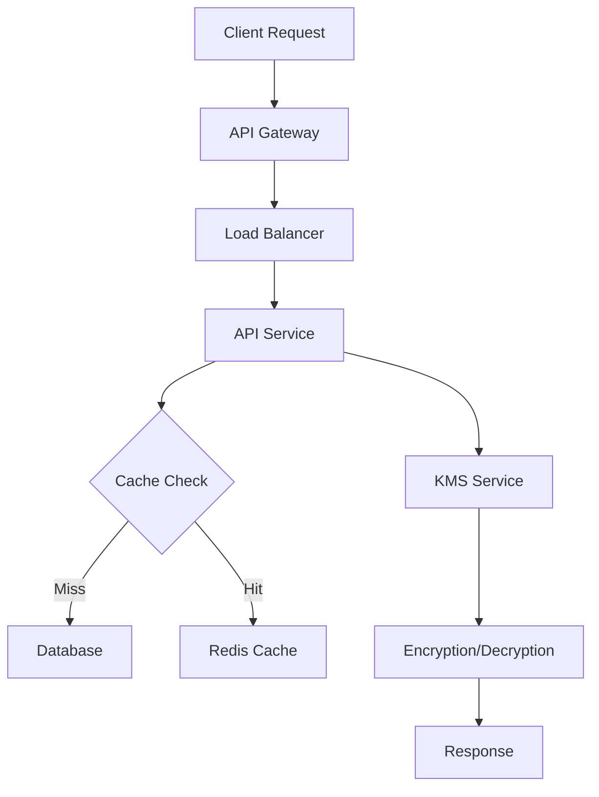
```mermaid
flowchart TD
    A[Client Request] --> B[API Gateway]
    B --> C[Load Balancer]
    C --> D[API Service]
    D --> E{Cache Check}
    E -->|Miss| F[Database]
    E -->|Hit| G[Redis Cache]
    D --> H[KMS Service]
    H --> I[Encryption/Decryption]
    I --> J[Response]
```

## 2.4 Cross-Cutting Concerns

### 2.4.1 Monitoring and Observability

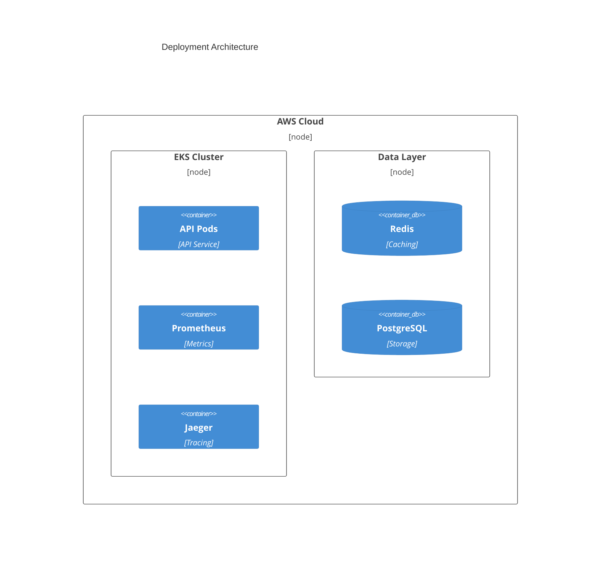
```mermaid
C4Deployment
    title Deployment Architecture
    
    Deployment_Node(aws, "AWS Cloud") {
        Deployment_Node(eks, "EKS Cluster") {
            Container(api, "API Pods", "API Service")
            Container(monitor, "Prometheus", "Metrics")
            Container(trace, "Jaeger", "Tracing")
        }
        Deployment_Node(data, "Data Layer") {
            ContainerDb(redis, "Redis", "Caching")
            ContainerDb(postgres, "PostgreSQL", "Storage")
        }
    }
```

### 2.4.2 Security Architecture

| Layer | Mechanism | Implementation |
|-------|-----------|----------------|
| Network | TLS 1.3 | API Gateway termination |
| Authentication | OAuth 2.0 | AWS Cognito integration |
| Authorization | RBAC | JWT claims validation |
| Data | Encryption | AWS KMS asymmetric keys |
| Infrastructure | Security groups | AWS VPC isolation |

### 2.4.3 Error Handling and Recovery

| Scenario | Strategy | Implementation |
|----------|----------|----------------|
| Service Failure | Circuit breaker | Polly retry policies |
| Data Corruption | Consistency checks | SHA-256 validation |
| Key Rotation Failure | Rollback mechanism | Transaction management |
| Network Issues | Request timeout | 30-second maximum |
| Cache Failure | Fallback to database | Graceful degradation |

## 2.5 Infrastructure Architecture

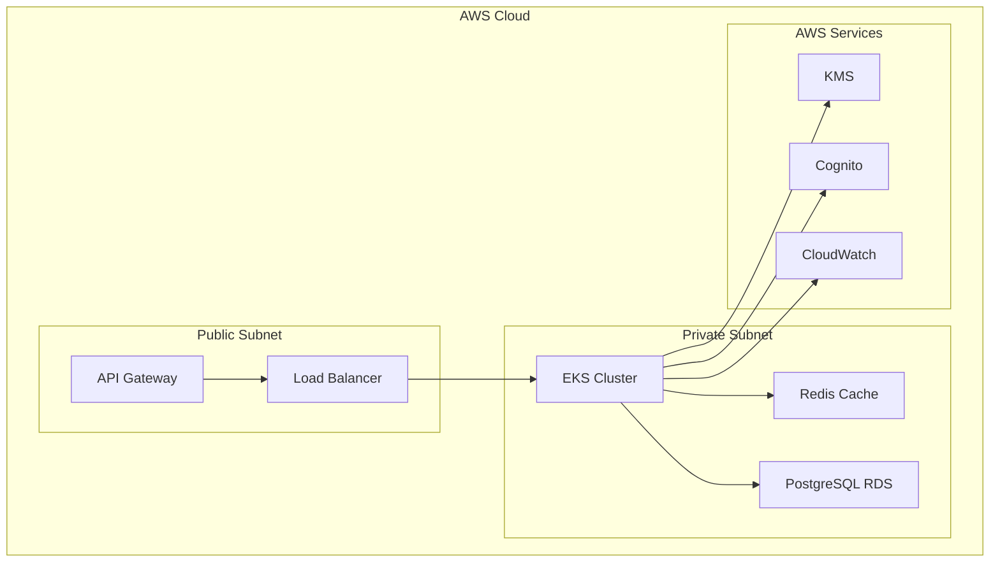
```mermaid
graph TB
    subgraph "AWS Cloud"
        subgraph "Public Subnet"
            A[API Gateway]
            B[Load Balancer]
        end
        
        subgraph "Private Subnet"
            C[EKS Cluster]
            D[Redis Cache]
            E[PostgreSQL RDS]
        end
        
        subgraph "AWS Services"
            F[KMS]
            G[Cognito]
            H[CloudWatch]
        end
    end
    
    A --> B
    B --> C
    C --> D
    C --> E
    C --> F
    C --> G
    C --> H
```

# 3. SYSTEM COMPONENTS ARCHITECTURE

## 3.1 API DESIGN

### 3.1.1 API Architecture

| Component | Specification | Details |
|-----------|--------------|---------|
| Protocol | HTTPS/REST | TLS 1.3 required |
| Authentication | OAuth 2.0 | AWS Cognito integration |
| Authorization | RBAC | JWT claims-based |
| Rate Limiting | Token bucket | 1000 req/min per client |
| Versioning | URI-based | /api/v1/* |
| Documentation | OpenAPI 3.0 | Swagger UI exposed |

### 3.1.2 Interface Specifications

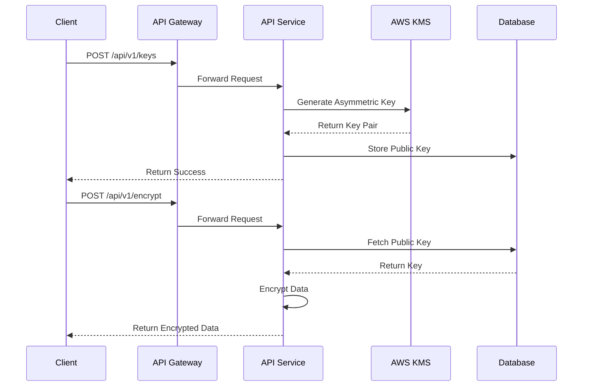
```mermaid
sequenceDiagram
    participant C as Client
    participant G as API Gateway
    participant A as API Service
    participant K as AWS KMS
    participant D as Database

    C->>G: POST /api/v1/keys
    G->>A: Forward Request
    A->>K: Generate Asymmetric Key
    K-->>A: Return Key Pair
    A->>D: Store Public Key
    A-->>C: Return Success

    C->>G: POST /api/v1/encrypt
    G->>A: Forward Request
    A->>D: Fetch Public Key
    D-->>A: Return Key
    A->>A: Encrypt Data
    A-->>C: Return Encrypted Data
```

#### Endpoint Definitions

| Endpoint | Method | Request Format | Response Format |
|----------|--------|----------------|-----------------|
| /api/v1/keys | POST | `{"userId": "string"}` | `{"success": boolean}` |
| /api/v1/encrypt | POST | `{"userId": "string", "data": string[]}` | `{"encryptedData": string[]}` |
| /api/v1/decrypt | POST | `{"userId": "string", "data": string[]}` | `{"decryptedData": string[]}` |
| /api/v1/rotate | POST | `{"userId": "string", "data": object[]}` | `{"rotatedData": object[]}` |

### 3.1.3 Integration Requirements

| Component | Requirement | Implementation |
|-----------|-------------|----------------|
| AWS KMS | Asymmetric key operations | AWS SDK integration |
| AWS Cognito | Authentication flow | OAuth token validation |
| Circuit Breaker | Fault tolerance | Polly with exponential backoff |
| API Gateway | Request routing | AWS API Gateway with custom domain |
| Monitoring | Performance metrics | CloudWatch integration |

## 3.2 DATABASE DESIGN

### 3.2.1 Schema Design

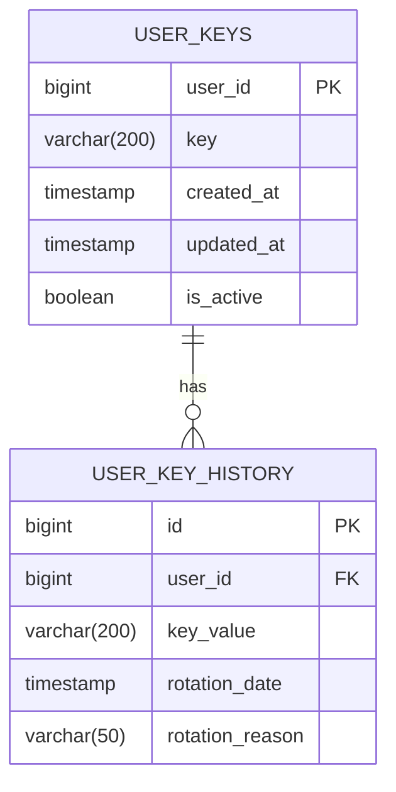
```mermaid
erDiagram
    USER_KEYS ||--o{ USER_KEY_HISTORY : has
    USER_KEYS {
        bigint user_id PK
        varchar(200) key
        timestamp created_at
        timestamp updated_at
        boolean is_active
    }
    USER_KEY_HISTORY {
        bigint id PK
        bigint user_id FK
        varchar(200) key_value
        timestamp rotation_date
        varchar(50) rotation_reason
    }
```

#### Table Structures

| Table | Index | Type | Columns | Purpose |
|-------|--------|------|----------|---------|
| user_keys | PK | B-tree | user_id | Primary lookup |
| user_keys | IDX_ACTIVE | B-tree | is_active, user_id | Active key queries |
| user_key_history | PK | B-tree | id | Primary lookup |
| user_key_history | IDX_USER_DATE | B-tree | user_id, rotation_date | History queries |

### 3.2.2 Data Management

| Aspect | Strategy | Implementation |
|--------|----------|----------------|
| Migrations | Forward-only | EF Core migrations |
| Versioning | Sequential | Auto-incrementing version |
| Retention | 7-year history | Automated archival |
| Auditing | Change tracking | Temporal tables |
| Encryption | At-rest | AWS RDS encryption |

### 3.2.3 Performance Considerations

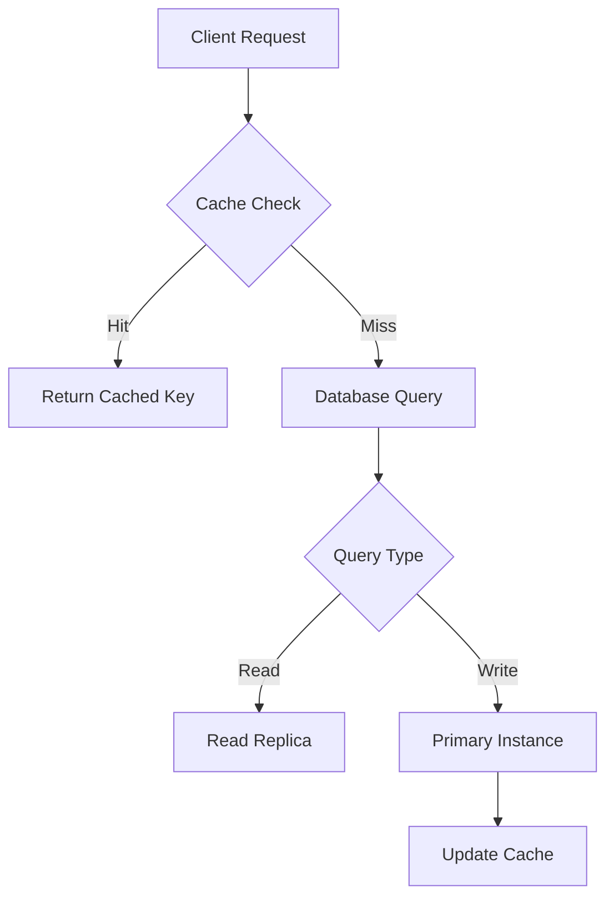
```mermaid
graph TD
    A[Client Request] --> B{Cache Check}
    B -->|Hit| C[Return Cached Key]
    B -->|Miss| D[Database Query]
    D --> E{Query Type}
    E -->|Read| F[Read Replica]
    E -->|Write| G[Primary Instance]
    G --> H[Update Cache]
```

| Aspect | Strategy | Details |
|--------|----------|---------|
| Caching | Redis | 15-minute TTL |
| Replication | Read replicas | Cross-AZ deployment |
| Scaling | Vertical | RDS instance scaling |
| Backups | Automated | Daily full backup |
| Recovery | Point-in-time | 35-day retention |

## 3.3 SECURITY DESIGN

### 3.3.1 Authentication Flow

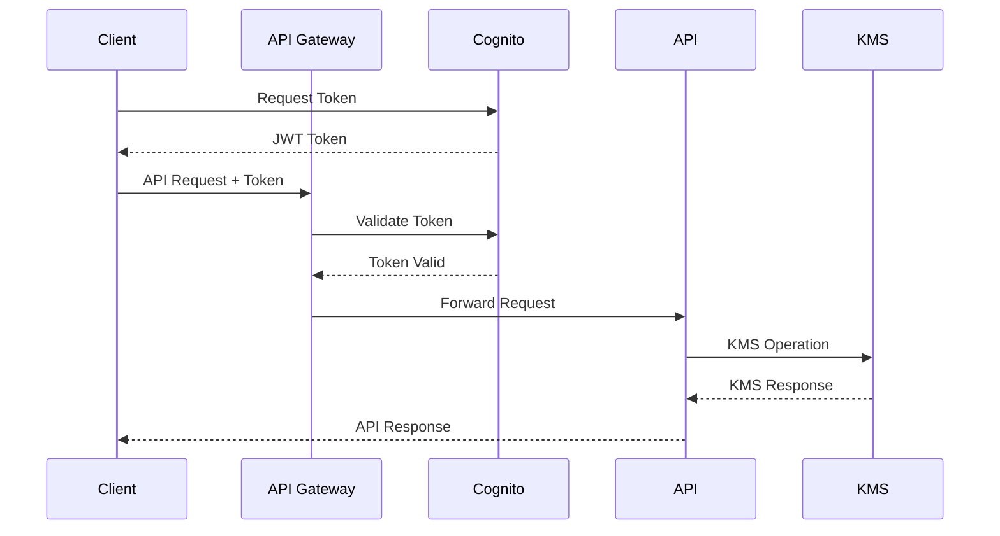
```mermaid
sequenceDiagram
    participant C as Client
    participant AG as API Gateway
    participant CO as Cognito
    participant A as API
    participant K as KMS

    C->>CO: Request Token
    CO-->>C: JWT Token
    C->>AG: API Request + Token
    AG->>CO: Validate Token
    CO-->>AG: Token Valid
    AG->>A: Forward Request
    A->>K: KMS Operation
    K-->>A: KMS Response
    A-->>C: API Response
```

### 3.3.2 Security Controls

| Control | Implementation | Purpose |
|---------|----------------|----------|
| TLS | 1.3 | Transport security |
| JWT | RS256 | Token signing |
| KMS | Asymmetric keys | Key management |
| WAF | AWS WAF | Request filtering |
| VPC | Private subnets | Network isolation |

### 3.3.3 Data Protection

| Data State | Protection Method | Implementation |
|------------|------------------|----------------|
| In-Transit | TLS 1.3 | API Gateway termination |
| At-Rest | AES-256 | RDS encryption |
| In-Memory | Secure string | Key sanitization |
| Backup | Encrypted | S3 server-side encryption |

# 4. TECHNOLOGY STACK

## 4.1 PROGRAMMING LANGUAGES

| Platform/Component | Language | Version | Justification |
|-------------------|----------|---------|---------------|
| API Service | C# | 12.0 | Required for .NET Core 9 compatibility, strong type safety |
| Infrastructure Code | HCL | 2.0 | Native AWS Terraform support |
| Database Scripts | SQL | PostgreSQL 16 | Native PostgreSQL compatibility |
| Build Scripts | PowerShell | 7.4 | Windows/.NET build automation |

## 4.2 FRAMEWORKS & LIBRARIES

### 4.2.1 Core Frameworks

| Framework | Version | Purpose | Justification |
|-----------|---------|---------|---------------|
| .NET Core | 9.0 | API Platform | Required by technical constraints |
| Entity Framework | 10.0 | ORM | Specified in requirements |
| ASP.NET Core | 9.0 | Web API | Native .NET Core integration |
| Polly | 8.0 | Resilience | Circuit breaker implementation |

### 4.2.2 Supporting Libraries

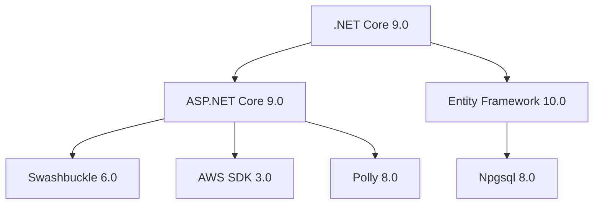
```mermaid
graph TD
    A[.NET Core 9.0] --> B[ASP.NET Core 9.0]
    A --> C[Entity Framework 10.0]
    B --> D[Swashbuckle 6.0]
    B --> E[AWS SDK 3.0]
    C --> F[Npgsql 8.0]
    B --> G[Polly 8.0]
```

| Library | Version | Purpose |
|---------|---------|---------|
| AWSSDK.KMS | 3.0 | AWS KMS integration |
| AWSSDK.Cognito | 3.0 | Authentication |
| Npgsql | 8.0 | PostgreSQL connectivity |
| Swashbuckle | 6.0 | OpenAPI documentation |
| Serilog | 3.0 | Structured logging |

## 4.3 DATABASES & STORAGE

### 4.3.1 Primary Database

| Component | Technology | Version | Purpose |
|-----------|------------|---------|----------|
| Key Storage | PostgreSQL | 16.0 | Encryption key persistence |
| Caching | Redis | 7.2 | Key caching layer |
| Audit Logs | AWS CloudWatch | - | Operational logging |

### 4.3.2 Data Architecture

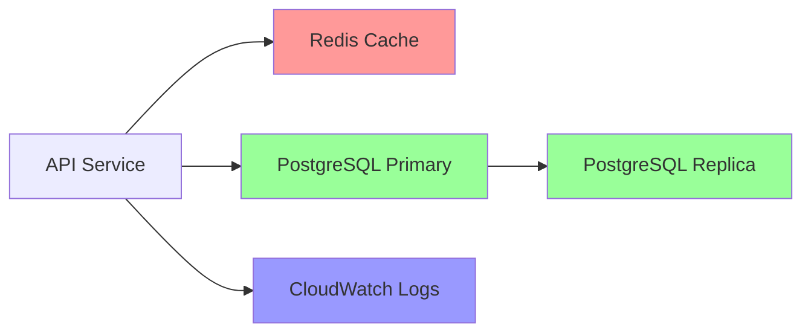
```mermaid
graph LR
    A[API Service] --> B[Redis Cache]
    A --> C[PostgreSQL Primary]
    C --> D[PostgreSQL Replica]
    A --> E[CloudWatch Logs]
    
    style B fill:#ff9999
    style C fill:#99ff99
    style D fill:#99ff99
    style E fill:#9999ff
```

## 4.4 THIRD-PARTY SERVICES

| Service | Purpose | Integration Method |
|---------|---------|-------------------|
| AWS KMS | Key Management | AWS SDK |
| AWS Cognito | Authentication | OAuth 2.0 |
| AWS CloudWatch | Monitoring | AWS SDK |
| AWS X-Ray | Distributed Tracing | SDK Instrumentation |
| AWS WAF | API Protection | API Gateway Integration |

### 4.4.1 Service Dependencies

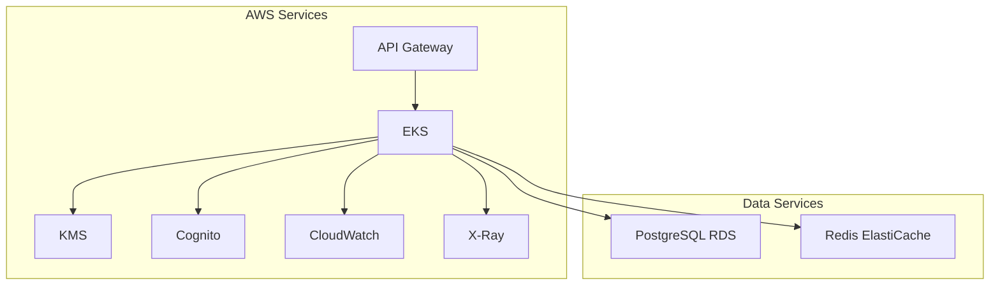
```mermaid
graph TB
    subgraph AWS Services
        A[API Gateway]
        B[EKS]
        C[KMS]
        D[Cognito]
        E[CloudWatch]
        F[X-Ray]
    end
    
    subgraph Data Services
        G[PostgreSQL RDS]
        H[Redis ElastiCache]
    end
    
    A --> B
    B --> C
    B --> D
    B --> E
    B --> F
    B --> G
    B --> H
```

## 4.5 DEVELOPMENT & DEPLOYMENT

### 4.5.1 Development Tools

| Tool | Version | Purpose |
|------|---------|---------|
| Visual Studio | 2024 | Primary IDE |
| Git | 2.42+ | Version Control |
| Docker Desktop | 24.0+ | Local Containers |
| AWS CLI | 2.13+ | AWS Management |

### 4.5.2 CI/CD Pipeline

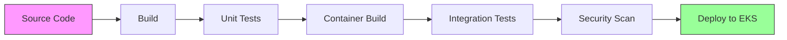
```mermaid
graph LR
    A[Source Code] --> B[Build]
    B --> C[Unit Tests]
    C --> D[Container Build]
    D --> E[Integration Tests]
    E --> F[Security Scan]
    F --> G[Deploy to EKS]
    
    style A fill:#f9f,stroke:#333
    style G fill:#9f9,stroke:#333
```

### 4.5.3 Infrastructure Components

| Component | Technology | Configuration |
|-----------|------------|---------------|
| Containers | Docker | Multi-stage builds |
| Orchestration | EKS | Managed node groups |
| Service Mesh | AWS App Mesh | Sidecar proxy |
| Load Balancer | AWS ALB | SSL termination |
| DNS | Route 53 | Custom domain |

### 4.5.4 Monitoring Stack

| Tool | Purpose | Integration |
|------|---------|------------|
| CloudWatch | Metrics & Logs | AWS SDK |
| X-Ray | Tracing | SDK Instrumentation |
| Prometheus | Container Metrics | EKS Add-on |
| Grafana | Visualization | Managed Service |

Based on the background information and previous sections, I'll generate the SYSTEM DESIGN section focusing on API and Database Design since this is a server-side only application without a user interface.

# 5. SYSTEM DESIGN

## 5.1 API DESIGN

### 5.1.1 REST API Endpoints

| Endpoint | Method | Description | Request Body | Response |
|----------|---------|-------------|--------------|-----------|
| /api/v1/keys | POST | Generate new encryption key | `{"userId": "string"}` | `{"success": bool}` |
| /api/v1/encrypt | POST | Encrypt string array | `{"userId": "string", "data": string[]}` | `{"encryptedData": string[]}` |
| /api/v1/decrypt | POST | Decrypt string array | `{"userId": "string", "data": string[]}` | `{"decryptedData": string[]}` |
| /api/v1/rotate | POST | Rotate encryption key | `{"userId": "string", "data": object[]}` | `{"rotatedData": object[]}` |

### 5.1.2 Request/Response Flow

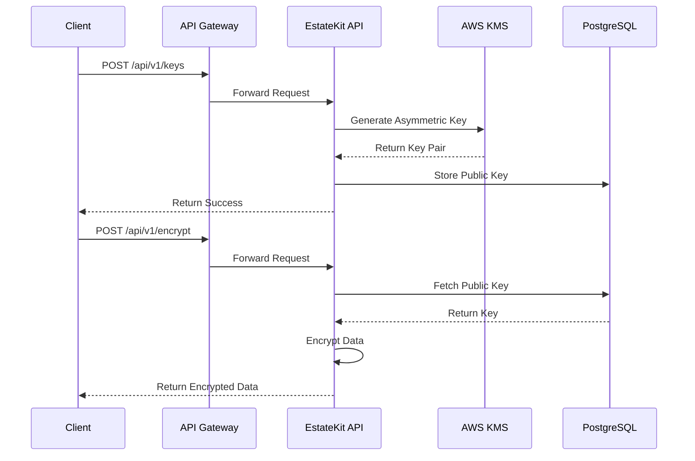
```mermaid
sequenceDiagram
    participant Client
    participant Gateway as API Gateway
    participant API as EstateKit API
    participant KMS as AWS KMS
    participant DB as PostgreSQL

    Client->>Gateway: POST /api/v1/keys
    Gateway->>API: Forward Request
    API->>KMS: Generate Asymmetric Key
    KMS-->>API: Return Key Pair
    API->>DB: Store Public Key
    API-->>Client: Return Success

    Client->>Gateway: POST /api/v1/encrypt
    Gateway->>API: Forward Request
    API->>DB: Fetch Public Key
    DB-->>API: Return Key
    API->>API: Encrypt Data
    API-->>Client: Return Encrypted Data
```

### 5.1.3 Authentication Flow

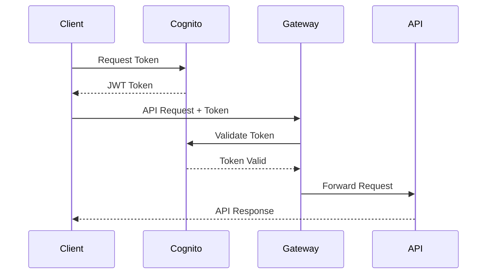
```mermaid
sequenceDiagram
    participant Client
    participant Cognito
    participant Gateway
    participant API

    Client->>Cognito: Request Token
    Cognito-->>Client: JWT Token
    Client->>Gateway: API Request + Token
    Gateway->>Cognito: Validate Token
    Cognito-->>Gateway: Token Valid
    Gateway->>API: Forward Request
    API-->>Client: API Response
```

## 5.2 DATABASE DESIGN

### 5.2.1 Schema Design

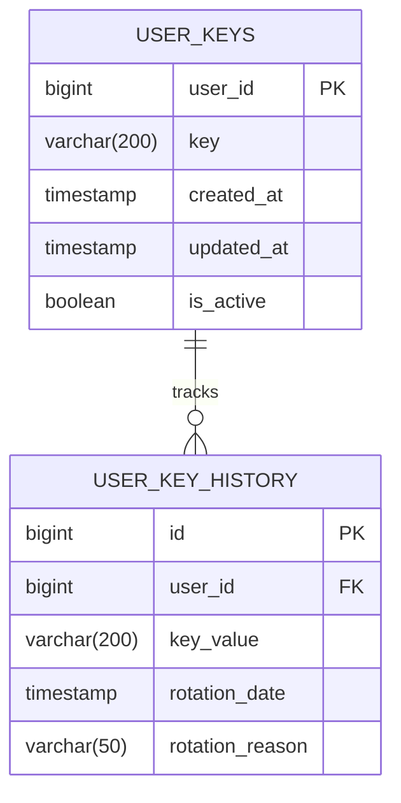
```mermaid
erDiagram
    USER_KEYS ||--o{ USER_KEY_HISTORY : tracks
    USER_KEYS {
        bigint user_id PK
        varchar(200) key
        timestamp created_at
        timestamp updated_at
        boolean is_active
    }
    USER_KEY_HISTORY {
        bigint id PK
        bigint user_id FK
        varchar(200) key_value
        timestamp rotation_date
        varchar(50) rotation_reason
    }
```

### 5.2.2 Table Specifications

| Table | Column | Type | Constraints | Description |
|-------|--------|------|-------------|-------------|
| user_keys | user_id | bigint | PK, NOT NULL | Unique user identifier |
| user_keys | key | varchar(200) | NOT NULL | Current public key |
| user_keys | created_at | timestamp | NOT NULL | Key creation timestamp |
| user_keys | updated_at | timestamp | NOT NULL | Last update timestamp |
| user_keys | is_active | boolean | NOT NULL | Key status flag |
| user_key_history | id | bigint | PK, NOT NULL | History record ID |
| user_key_history | user_id | bigint | FK, NOT NULL | Reference to user_keys |
| user_key_history | key_value | varchar(200) | NOT NULL | Historical key value |
| user_key_history | rotation_date | timestamp | NOT NULL | Rotation timestamp |
| user_key_history | rotation_reason | varchar(50) | NULL | Reason for rotation |

### 5.2.3 Data Access Patterns

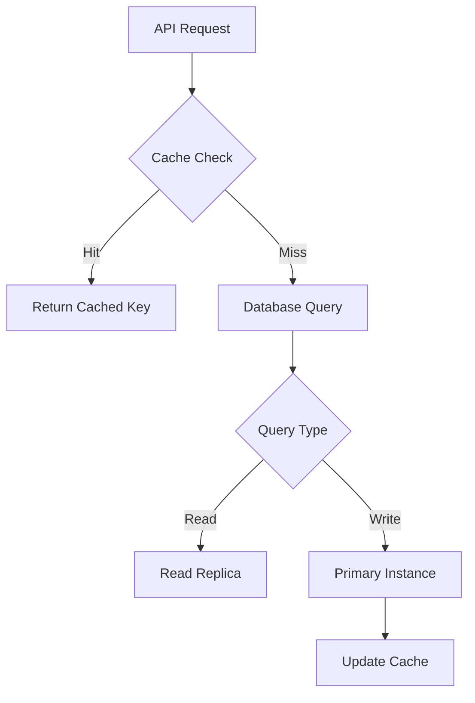
```mermaid
flowchart TD
    A[API Request] --> B{Cache Check}
    B -->|Hit| C[Return Cached Key]
    B -->|Miss| D[Database Query]
    D --> E{Query Type}
    E -->|Read| F[Read Replica]
    E -->|Write| G[Primary Instance]
    G --> H[Update Cache]
```

## 5.3 SYSTEM ARCHITECTURE

### 5.3.1 Component Architecture

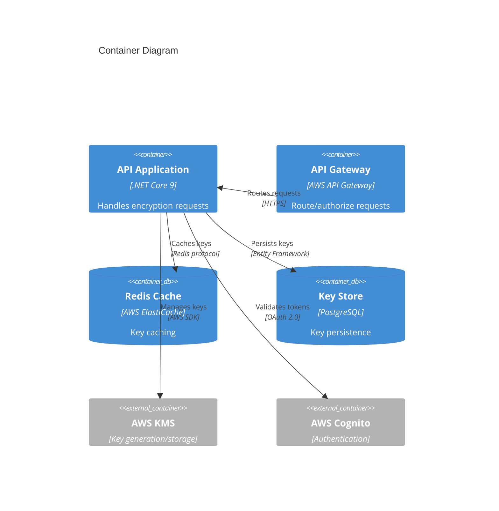
```mermaid
C4Container
    title Container Diagram
    
    Container(api, "API Application", ".NET Core 9", "Handles encryption requests")
    Container(gateway, "API Gateway", "AWS API Gateway", "Route/authorize requests")
    ContainerDb(cache, "Redis Cache", "AWS ElastiCache", "Key caching")
    ContainerDb(db, "Key Store", "PostgreSQL", "Key persistence")
    Container_Ext(kms, "AWS KMS", "Key generation/storage")
    Container_Ext(cognito, "AWS Cognito", "Authentication")
    
    Rel(gateway, api, "Routes requests", "HTTPS")
    Rel(api, cache, "Caches keys", "Redis protocol")
    Rel(api, db, "Persists keys", "Entity Framework")
    Rel(api, kms, "Manages keys", "AWS SDK")
    Rel(api, cognito, "Validates tokens", "OAuth 2.0")
```

### 5.3.2 Infrastructure Design

```mermaid
graph TB
    subgraph "AWS Cloud"
        subgraph "Public Subnet"
            A[API Gateway]
            B[Load Balancer]
        end
        
        subgraph "Private Subnet"
            C[EKS Cluster]
            D[Redis Cache]
            E[PostgreSQL RDS]
        end
        
        subgraph "AWS Services"
            F[KMS]
            G[Cognito]
            H[CloudWatch]
        end
    end
    
    A --> B
    B --> C
    C --> D
    C --> E
    C --> F
    C --> G
    C --> H
```

### 5.3.3 Security Architecture

| Layer | Implementation | Details |
|-------|----------------|---------|
| Network | VPC isolation | Private subnets for compute/data |
| Transport | TLS 1.3 | End-to-end encryption |
| Application | OAuth 2.0 | JWT token validation |
| Data | AWS KMS | Asymmetric key encryption |
| Infrastructure | Security groups | Restricted access control |
| Monitoring | CloudWatch | Security event logging |

### 5.3.4 Scalability Design

| Component | Scaling Strategy | Implementation |
|-----------|-----------------|----------------|
| API Service | Horizontal | EKS pod autoscaling |
| Database | Vertical + Read Replicas | RDS scaling |
| Cache | Cluster | ElastiCache sharding |
| Load Balancer | Request-based | ALB auto-scaling |
| Key Management | Regional | KMS multi-region |

# 6. USER INTERFACE DESIGN

No user interface required. This is a server-side API service that provides encryption functionality through REST endpoints only. All interactions are programmatic through the defined API interfaces.

For user interface requirements, please refer to the consuming applications that integrate with this API service.

# 7. SECURITY CONSIDERATIONS

## 7.1 AUTHENTICATION AND AUTHORIZATION

### 7.1.1 Authentication Flow

```mermaid
sequenceDiagram
    participant Client
    participant Gateway as API Gateway
    participant Cognito
    participant API as EstateKit API
    participant KMS

    Client->>Cognito: Request OAuth Token
    Cognito-->>Client: Return JWT Token
    Client->>Gateway: API Request + JWT
    Gateway->>Cognito: Validate Token
    Cognito-->>Gateway: Token Valid
    Gateway->>API: Forward Request + Claims
    API->>KMS: Request Operation
    KMS-->>API: Operation Result
    API-->>Client: API Response
```

### 7.1.2 Authorization Controls

| Level | Mechanism | Implementation |
|-------|-----------|----------------|
| API Gateway | OAuth 2.0 | AWS Cognito token validation |
| Service | RBAC | JWT claim-based authorization |
| Database | IAM | AWS RDS IAM authentication |
| KMS | IAM | Key usage permissions |
| Infrastructure | Security Groups | AWS VPC access control |

### 7.1.3 Token Management

| Aspect | Implementation | Details |
|---------|----------------|---------|
| Token Format | JWT (RS256) | Asymmetric signing |
| Token Lifetime | 1 hour | Auto-expiration |
| Refresh Strategy | Sliding expiration | 24-hour refresh window |
| Claims | Role-based | Service-specific permissions |
| Revocation | Token blacklist | Redis-backed invalidation |

## 7.2 DATA SECURITY

### 7.2.1 Encryption Layers

```mermaid
graph TD
    A[Data Entry] -->|TLS 1.3| B[Transport Layer]
    B -->|OAuth| C[Application Layer]
    C -->|KMS| D[Encryption Layer]
    D -->|AES-256| E[Storage Layer]
    
    style A fill:#f9f,stroke:#333
    style B fill:#bbf,stroke:#333
    style C fill:#bfb,stroke:#333
    style D fill:#fbf,stroke:#333
    style E fill:#fbb,stroke:#333
```

### 7.2.2 Key Management

| Component | Protection Method | Implementation |
|-----------|------------------|----------------|
| Public Keys | Database Encryption | RDS encryption |
| Private Keys | AWS KMS | Hardware security modules |
| Key Rotation | Automated | 90-day rotation cycle |
| Key Backup | Encrypted | Cross-region replication |
| Access Control | IAM Policies | Least privilege access |

### 7.2.3 Data Protection States

| State | Protection Method | Implementation |
|-------|------------------|----------------|
| In Transit | TLS 1.3 | API Gateway termination |
| At Rest | AES-256 | RDS encryption |
| In Process | Secure string | Memory encryption |
| In Backup | KMS encryption | S3 server-side encryption |
| In Cache | Encrypted | Redis at-rest encryption |

## 7.3 SECURITY PROTOCOLS

### 7.3.1 Network Security

```mermaid
graph TB
    subgraph Public Zone
        A[API Gateway]
        B[WAF]
    end
    
    subgraph Private Zone
        C[EKS Cluster]
        D[Redis Cache]
        E[RDS Database]
    end
    
    subgraph AWS Services
        F[KMS]
        G[Cognito]
    end
    
    A -->|TLS| B
    B -->|mTLS| C
    C -->|TLS| D
    C -->|TLS| E
    C -->|HTTPS| F
    C -->|HTTPS| G
```

### 7.3.2 Security Standards Compliance

| Standard | Implementation | Validation |
|----------|----------------|------------|
| FIPS 140-2 | AWS KMS HSMs | Annual certification |
| PCI DSS | Network isolation | Quarterly scans |
| SOC 2 | Access controls | Annual audit |
| GDPR | Data encryption | Regular assessment |
| ISO 27001 | Security controls | Annual certification |

### 7.3.3 Security Monitoring

| Component | Monitoring Method | Alert Threshold |
|-----------|------------------|-----------------|
| API Gateway | AWS WAF | 10 suspicious requests/minute |
| Authentication | Cognito logs | 5 failed attempts/minute |
| Key Usage | KMS metrics | Unusual access patterns |
| Network | VPC Flow Logs | Unauthorized access attempts |
| Database | RDS monitoring | Failed connection spikes |

### 7.3.4 Incident Response

| Phase | Action | Implementation |
|-------|--------|----------------|
| Detection | Log analysis | CloudWatch alerts |
| Containment | Access revocation | Automated key deactivation |
| Investigation | Audit trail | X-Ray tracing |
| Recovery | System restore | Automated failover |
| Prevention | Security patches | Automated updates |

### 7.3.5 Security Controls Matrix

| Control Type | Control | Implementation |
|-------------|----------|----------------|
| Preventive | Input validation | API request validation |
| Detective | Audit logging | CloudWatch Logs |
| Corrective | Auto-remediation | AWS Systems Manager |
| Deterrent | Rate limiting | API Gateway throttling |
| Compensating | Redundancy | Multi-AZ deployment |

# 8. INFRASTRUCTURE

## 8.1 DEPLOYMENT ENVIRONMENT

### 8.1.1 Production Environment

| Component | Specification | Details |
|-----------|--------------|----------|
| Cloud Platform | AWS | US-East-1 primary, US-West-2 DR |
| Network | VPC | Private subnets for compute/data |
| Compute | EKS | Managed Kubernetes clusters |
| Storage | RDS | Multi-AZ PostgreSQL |
| Cache | ElastiCache | Redis cluster |
| CDN | CloudFront | API request distribution |

### 8.1.2 Environment Architecture

```mermaid
graph TB
    subgraph "AWS Region Primary"
        subgraph "VPC"
            subgraph "Public Subnet"
                ALB[Application Load Balancer]
                AGW[API Gateway]
            end
            
            subgraph "Private Subnet"
                EKS[EKS Cluster]
                RDS[(PostgreSQL RDS)]
                RED[(Redis Cache)]
            end
        end
        
        subgraph "AWS Services"
            KMS[Key Management]
            COG[Cognito]
            CW[CloudWatch]
        end
    end
    
    ALB --> AGW
    AGW --> EKS
    EKS --> RDS
    EKS --> RED
    EKS --> KMS
    EKS --> COG
    EKS --> CW
```

## 8.2 CLOUD SERVICES

| Service | Purpose | Configuration |
|---------|---------|---------------|
| EKS | Container orchestration | Managed node groups, v1.27 |
| RDS | Database hosting | PostgreSQL 16, Multi-AZ |
| ElastiCache | Key caching | Redis 7.2, cluster mode |
| KMS | Key management | Asymmetric key support |
| Cognito | Authentication | OAuth 2.0/OIDC |
| CloudWatch | Monitoring | Custom metrics, logs |
| Route 53 | DNS management | Latency-based routing |
| WAF | API protection | Custom rule sets |

## 8.3 CONTAINERIZATION

### 8.3.1 Container Strategy

```mermaid
graph TD
    A[Base Image] -->|.NET 9 SDK| B[Build Stage]
    B -->|Compile| C[Runtime Stage]
    C -->|.NET 9 Runtime| D[Final Image]
    D -->|Deploy| E[EKS Pod]
    
    style A fill:#f9f,stroke:#333
    style B fill:#bbf,stroke:#333
    style C fill:#bfb,stroke:#333
    style D fill:#fbf,stroke:#333
    style E fill:#fbb,stroke:#333
```

### 8.3.2 Docker Configuration

| Component | Specification | Purpose |
|-----------|--------------|----------|
| Base Image | mcr.microsoft.com/dotnet/sdk:9.0 | Build environment |
| Runtime Image | mcr.microsoft.com/dotnet/aspnet:9.0 | Production runtime |
| Container Registry | Amazon ECR | Image storage |
| Image Scanning | ECR scanning | Security validation |
| Resource Limits | CPU: 2 cores, Memory: 4GB | Resource management |

## 8.4 ORCHESTRATION

### 8.4.1 Kubernetes Architecture

```mermaid
graph TB
    subgraph "EKS Cluster"
        subgraph "Node Group 1"
            P1[Pod 1]
            P2[Pod 2]
        end
        
        subgraph "Node Group 2"
            P3[Pod 3]
            P4[Pod 4]
        end
        
        SVC[Service]
        ING[Ingress]
        HPA[HorizontalPodAutoscaler]
    end
    
    ING --> SVC
    SVC --> P1
    SVC --> P2
    SVC --> P3
    SVC --> P4
    HPA --> P1
    HPA --> P2
    HPA --> P3
    HPA --> P4
```

### 8.4.2 EKS Configuration

| Component | Configuration | Purpose |
|-----------|--------------|----------|
| Node Groups | 2-6 nodes per group | High availability |
| Pod Autoscaling | CPU threshold: 70% | Automatic scaling |
| Affinity Rules | Zone distribution | Fault tolerance |
| Service Mesh | AWS App Mesh | Service communication |
| Network Policy | Calico | Network security |

## 8.5 CI/CD PIPELINE

### 8.5.1 Pipeline Architecture

```mermaid
graph LR
    A[Source] -->|Git Push| B[Build]
    B -->|Unit Tests| C[Test]
    C -->|Security Scan| D[Scan]
    D -->|Container Build| E[Package]
    E -->|Deploy to Dev| F[Development]
    F -->|Integration Tests| G[QA]
    G -->|Deploy to Prod| H[Production]
    
    style A fill:#f9f,stroke:#333
    style H fill:#bfb,stroke:#333
```

### 8.5.2 Pipeline Components

| Stage | Tools | Actions |
|-------|-------|---------|
| Source Control | GitHub | Code versioning |
| Build | AWS CodeBuild | Compilation, testing |
| Security | SonarQube, OWASP | Code analysis |
| Artifacts | ECR | Container images |
| Deployment | AWS CodeDeploy | EKS deployment |
| Testing | xUnit, Postman | Automated testing |
| Monitoring | CloudWatch | Pipeline metrics |

### 8.5.3 Deployment Strategy

| Environment | Strategy | Configuration |
|-------------|----------|---------------|
| Development | Rolling update | Max surge: 1 |
| Staging | Blue/Green | Parallel environments |
| Production | Canary | 10% traffic increment |
| Rollback | Automated | 5-minute threshold |

# 9. APPENDICES

## 9.1 ADDITIONAL TECHNICAL INFORMATION

### 9.1.1 Key Rotation Schedule

| Rotation Type | Frequency | Trigger | Action |
|--------------|-----------|---------|---------|
| Regular | 90 days | Automated | Full key rotation |
| On-demand | As needed | Manual/API | Emergency rotation |
| Compliance | Yearly | Audit requirement | Documented rotation |
| Compromise | Immediate | Security event | Emergency + audit |

### 9.1.2 AWS KMS Key Configuration

```mermaid
flowchart TD
    A[AWS KMS Master Key] -->|Creates| B[Customer Master Key]
    B -->|Generates| C[Data Key Pair]
    C -->|Public| D[Encryption Operations]
    C -->|Private| E[Decryption Operations]
    D -->|Stores| F[PostgreSQL]
    E -->|Secured by| G[AWS KMS HSM]
```

### 9.1.3 Error Response Structure

| Error Code | HTTP Status | Description | Recovery Action |
|------------|-------------|-------------|-----------------|
| KEY001 | 404 | Key not found | Generate new key |
| KEY002 | 409 | Key rotation in progress | Retry after delay |
| ENC001 | 400 | Invalid input format | Validate input |
| AUTH001 | 401 | Invalid OAuth token | Refresh token |
| SYS001 | 500 | KMS service error | Contact support |

## 9.2 GLOSSARY

| Term | Definition |
|------|------------|
| Asymmetric Encryption | Cryptographic system using key pairs for encryption/decryption |
| Circuit Breaker | Design pattern preventing cascade failures in distributed systems |
| Data Key Pair | Public/private key combination for encryption operations |
| Hardware Security Module (HSM) | Physical device managing digital keys |
| Key Management Service | AWS service for creating and controlling encryption keys |
| Multi-AZ Deployment | Database replication across availability zones |
| Point-in-time Recovery | Database restoration capability to any past moment |
| Role-Based Access Control | Security model controlling access based on roles |
| Soft Deletion | Marking records as inactive instead of permanent deletion |
| Transaction Isolation | Database mechanism preventing concurrent access conflicts |

## 9.3 ACRONYMS

| Acronym | Full Form |
|---------|-----------|
| AES | Advanced Encryption Standard |
| ALB | Application Load Balancer |
| CQRS | Command Query Responsibility Segregation |
| ECR | Elastic Container Registry |
| EKS | Elastic Kubernetes Service |
| FIPS | Federal Information Processing Standards |
| HSM | Hardware Security Module |
| IAM | Identity and Access Management |
| JWT | JSON Web Token |
| KMS | Key Management Service |
| mTLS | Mutual Transport Layer Security |
| OIDC | OpenID Connect |
| RBAC | Role-Based Access Control |
| RDS | Relational Database Service |
| RPO | Recovery Point Objective |
| RTO | Recovery Time Objective |
| SOC | Service Organization Control |
| TLS | Transport Layer Security |
| VPC | Virtual Private Cloud |
| WAF | Web Application Firewall |

## 9.4 COMPLIANCE MATRIX

| Requirement | Standard | Implementation | Verification |
|-------------|----------|----------------|--------------|
| Key Length | FIPS 140-2 | 2048-bit RSA | AWS KMS HSM |
| Data Protection | GDPR | Encryption at rest | RDS encryption |
| Access Control | SOC 2 | RBAC + OAuth | AWS Cognito |
| Audit Logging | PCI DSS | CloudWatch Logs | Log retention |
| Key Management | ISO 27001 | KMS + HSM | Key rotation |
| Network Security | NIST | VPC + WAF | Security groups |

## 9.5 DEPENDENCIES MATRIX

```mermaid
graph TD
    A[EstateKit API] -->|Requires| B[AWS Services]
    A -->|Uses| C[Frameworks]
    A -->|Connects to| D[Data Storage]
    
    B -->|Auth| B1[Cognito]
    B -->|Keys| B2[KMS]
    B -->|Containers| B3[EKS]
    
    C -->|Runtime| C1[.NET Core 9]
    C -->|ORM| C2[EF Core 10]
    C -->|API| C3[ASP.NET Core]
    
    D -->|Primary| D1[PostgreSQL]
    D -->|Cache| D2[Redis]
    D -->|Logs| D3[CloudWatch]
```