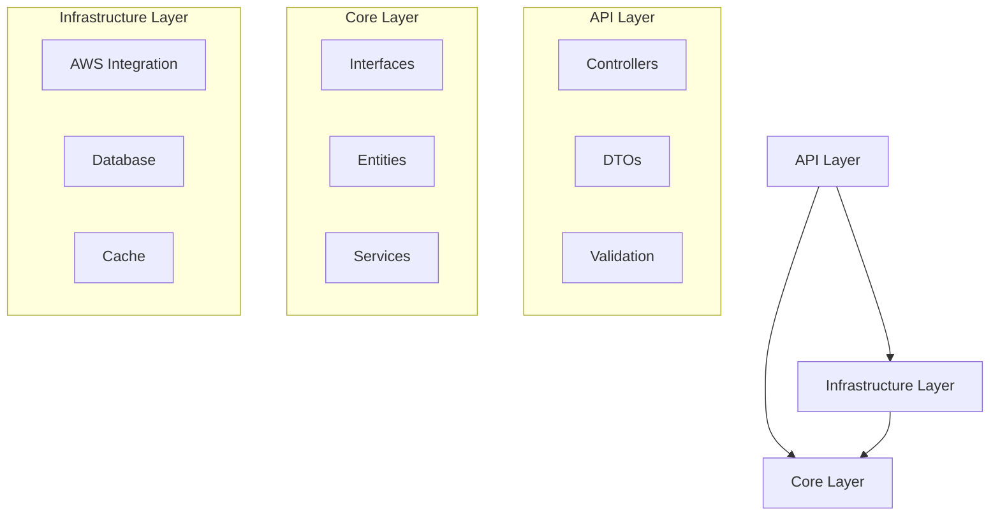

# EstateKit Personal Information API

A secure encryption service designed to protect sensitive personal data through user-specific encryption keys using AWS KMS.

## Overview

The EstateKit Personal Information API is a .NET Core 9 microservice that provides secure encryption services for personal data using AWS Key Management Service (KMS). It implements a separate encryption key management system that ensures encrypted data in the primary EstateKit database cannot be decrypted without proper authorization.

## Architecture

### Clean Architecture Implementation


## Prerequisites

- .NET Core SDK 9.0
- Docker Desktop 24.0+
- AWS CLI 2.13+
- Visual Studio 2024 or VS Code
- Git 2.42+

## Technology Stack

- **Framework**: .NET Core 9.0
- **Database**: PostgreSQL 16.0
- **Cache**: Redis 7.2
- **Cloud Services**: AWS KMS, Cognito, CloudWatch
- **Container**: Docker, Docker Compose
- **CI/CD**: GitHub Actions
- **Monitoring**: Prometheus, Grafana

## Getting Started

1. Clone the repository:
```bash
git clone https://github.com/estatekit/personal-information-api.git
cd personal-information-api
```

2. Set up environment variables:
```bash
cp .env.example .env.development
```

3. Start development environment:
```bash
docker-compose up -d
```

4. Access the API:
```
API: http://localhost:5000
Swagger: http://localhost:5000/swagger
```

## Project Structure

```
src/
├── EstateKit.Api/            # API Layer
│   ├── Controllers/          # API endpoints
│   ├── DTOs/                # Data transfer objects
│   └── Validation/          # Request validation
├── EstateKit.Core/          # Core Layer
│   ├── Interfaces/          # Core interfaces
│   ├── Entities/           # Domain entities
│   └── Services/           # Core services
└── EstateKit.Infrastructure/ # Infrastructure Layer
    ├── Data/               # Data access
    ├── Services/           # External services
    └── Caching/           # Cache implementation
```

## API Endpoints

| Endpoint | Method | Description |
|----------|--------|-------------|
| /api/v1/keys | POST | Generate new encryption key |
| /api/v1/encrypt | POST | Encrypt string array |
| /api/v1/decrypt | POST | Decrypt string array |
| /api/v1/rotate | POST | Rotate encryption key |

## Security Features

- OAuth 2.0 authentication via AWS Cognito
- Asymmetric key encryption using AWS KMS
- TLS 1.3 for all communications
- RBAC with JWT claims validation
- Automated key rotation every 90 days

## Development Guidelines

### Code Style
- Use C# 12.0 features
- Follow Microsoft's .NET coding conventions
- Implement comprehensive XML documentation
- Use nullable reference types

### Testing Requirements
- Unit tests for all business logic
- Integration tests for external services
- Security testing with OWASP guidelines
- Performance testing with k6

### Security Requirements
- Validate all inputs
- Implement proper error handling
- Use secure configuration practices
- Follow least privilege principle

## Configuration

### AWS Services
```json
{
  "AWS": {
    "Region": "us-east-1",
    "ServiceURL": "http://localhost:4566",
    "KMS": {
      "KeySpec": "RSA_2048",
      "KeyUsage": "ENCRYPT_DECRYPT"
    }
  }
}
```

### Database
```json
{
  "ConnectionStrings": {
    "PostgreSQL": "Host=localhost;Database=estatekit;Username=dev_user;Password=dev_password",
    "Redis": "localhost:6379"
  }
}
```

## Monitoring

- Application metrics via Prometheus
- Distributed tracing with AWS X-Ray
- Log aggregation in CloudWatch
- Custom dashboards in Grafana

## Deployment

### Production Requirements
- Multi-AZ deployment on AWS EKS
- Auto-scaling based on CPU/Memory
- Regular security patches
- Automated backup strategy

### Container Configuration
```yaml
resources:
  limits:
    cpu: "2"
    memory: "4Gi"
  requests:
    cpu: "500m"
    memory: "1Gi"
```

## License

© 2024 EstateKit. All rights reserved.